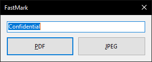

# FastMark

Quickly add a watermark to PDF files or pictures.

 

Use through the SendTo entry in the context menu.

Tested on Windows 10 x64, probably works on all Windows versions supporting .NET 5.

Uses CSharpLib for shortcut creation, iTextSharp for PDF creation and PdfiumViewer for PDF rendering.
